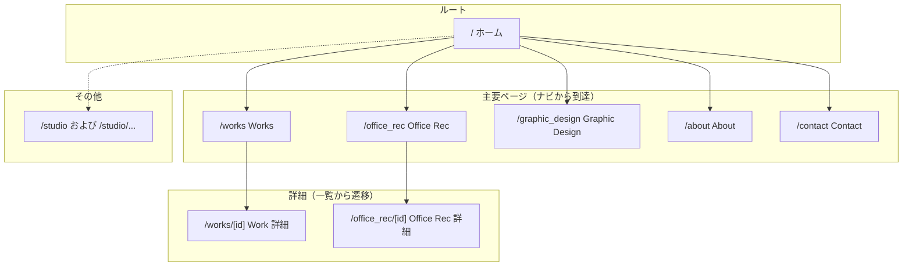

# サイトマップ（hrc-website）

Next.js App Router（`app/`）に基づく URL 構造。`next.config` のリライトおよび `middleware` は未使用のため、以下がそのままパスに対応する。

## パス一覧

| パス | 種別 | 備考 |
|------|------|------|
| `/` | 固定 | トップ |
| `/about` | 固定 | About |
| `/contact` | 固定 | お問い合わせ |
| `/graphic_design` | 固定 | Graphic Design |
| `/office_rec` | 固定 | Office Rec 一覧 |
| `/office_rec/[id]` | 動的 | 各 Office Rec 詳細 |
| `/works` | 固定 | Works 一覧 |
| `/works/[id]` | 動的 | 各 Work 詳細 |
| `/studio/[[...tool]]` | キャッチオール | `/studio` および `/studio/...`（Sanity Studio 等） |

## ナビゲーション

ヘッダー／フッターからの主要リンク: `/` · `/works` · `/office_rec` · `/graphic_design` · `/about` · `/contact`

## 図（Mermaid）



- **実線**: ナビや一覧からの典型的な導線
- **点線**: ナビに載っていないルート（Studio は管理用）

## ツリー（ASCII）

```
/
├── about
├── contact
├── graphic_design
├── office_rec
│   └── [id]          … 動的詳細
├── works
│   └── [id]          … 動的詳細
├── studio            … オプショナルセグメント（/studio 単体も可）
│   └── [...]         … キャッチオール
```
